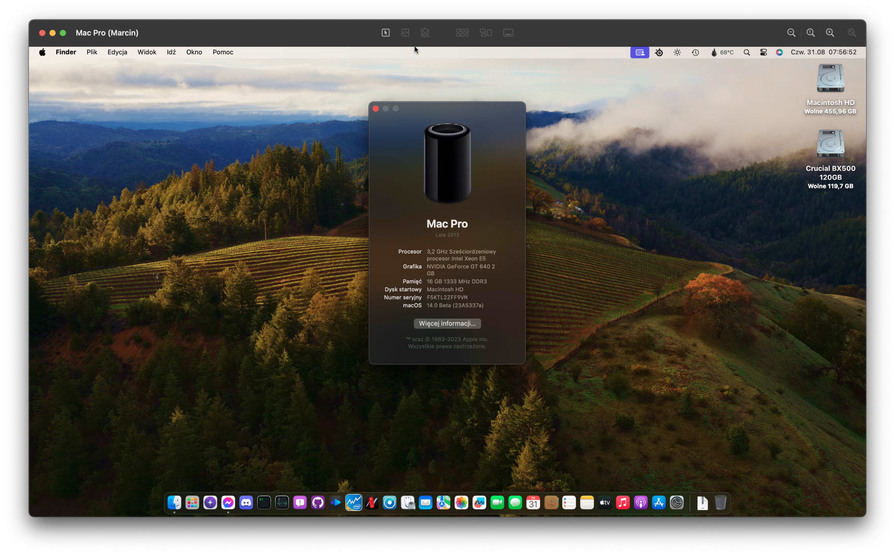
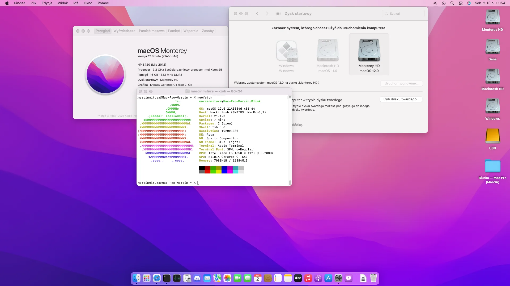

# Hackintosh-OpenCore-HP-Z420

**Premade EFI of OpenCore bootloader for HP Z420 is here, running Ventura and Sonoma!**

## Current Version: [OpenCore 0.9.4 DEBUG](https://github.com/acidanthera/OpenCorePkg/releases/tag/0.9.4)

This repository provides a complete "Plug-and-Play" EFI setup for the OpenCore bootloader, along with all necessary files to install and run macOS on an HP Z420.

## Table of Contents

- [Running macOS Sonoma](#sonoma-notes)
- [Installation Guide](#installation)
- [Notes for macOS Monterey](Notes/Monterey-NOTES.md)

## What's Required to Make It Boot

1. For macOS 13 and newer, use OpenCore 0.8.3+ (latest recommended). **Avoid RSR updates as they don't work with Rosetta Cryptex.**

2. Native dGPUs with AVX2 support are recommended. For Polaris and Vega dGPUs, root patching is required, but Navi GPUs are not supported.

3. Lack of AVX2 requires CryptexFixup for macOS 13+.

4. For Metal 1 dGPUs (e.g., Kepler), disable mediaanalysisd using `revblock=media` in NVRAM settings.

5. For non-AVX2 CPUs, disable f16c sysctl reporting by adding `revpatch=16c` to NVRAM settings.

6. OCLP now works with Ventura since 0.5.0+. For Sonoma, OCLP 0.6.9 is recommended.

7. While Legacy Metal dGPUs work for most part, there are still some issues.

8. Follow OCLP preparation steps, including setting SIP to 0x308 and disabling Apple Secure Boot.

9. Use AMFIPass (AMFIPass-v1.3.1-RELEASE.zip) and re-enable AMFI for Sonoma.

Sources:
- [macOS Ventura and OpenCore Legacy Patcher Support](https://github.com/dortania/OpenCore-Legacy-Patcher/issues/998)
- [Legacy Metal Graphics Support and macOS Ventura - Sonoma](https://github.com/dortania/OpenCore-Legacy-Patcher/issues/1008)
- [Idle panic on Metal 1 GPUs during face analysis](https://github.com/dortania/OpenCore-Legacy-Patcher/pull/1013)
- [Rapid Security Response with legacy Macs](https://github.com/dortania/OpenCore-Legacy-Patcher/issues/1019)
- [Resolve CoreGraphics.framework crashing](https://github.com/dortania/OpenCore-Legacy-Patcher/commit/c0825ed24e98688ff430c30324f11b5c41840b8a)
- [Currently unsupported hardware in Ventura](https://dortania.github.io/OpenCore-Legacy-Patcher/VENTURA-DROP.html#currently-unsupported-broken-hardware-in-ventura)

## Sonoma Notes

To run Sonoma successfully, you need at least OpenCore 0.9.3+ (officially 0.8.3 for AVX2 machines). Remember, Sonoma is not a KDKless install, so `KDKLessWorkaround` won't work.

Install macOS 14 using the latest nightly builds open for public: [Nightly.link: OpenCore-Patcher.app (Sonoma Development)](https://nightly.link/dortania/OpenCore-Legacy-Patcher/workflows/build-app-wxpython/sonoma-development/OpenCore-Patcher.app%20%28GUI%29.zip).

Follow OCLP prompts and reboot.

Sources:
- [macOS Sonoma and OpenCore Legacy Patcher Support](https://github.com/dortania/OpenCore-Legacy-Patcher/issues/1076)
- [Preliminary support for macOS Sonoma](https://github.com/dortania/OpenCore-Legacy-Patcher/pull/1077)

**Please note: Things are still in development for both sides, and there may be issues or graphical glitches.**

## Installation

Internal USB 3.0 doesn't work, but USB 2.0 ports should function properly.

USB mapping is important, so consider using USBMap's QUICKSTART guide [here](https://github.com/corpnewt/USBMap/blob/master/README.md#quick-start).

For USB 3.0, consider using the [Inatek KT4004 PCIe expansion card](https://www.amazon.pl/Inateck-Karta-USB-porty-ExpresCard/dp/B00HJ1DULE?th=1), which has native support.

To install macOS Ventura or newer successfully, use MacPro7,1 SMBIOS or the `force-vmm-install` branch of RestrictEvents. 

- Use EFI from the `MP7,1_InstallEFI` folder (if USB detection issues persist, see the USB section at the end of this README).

- Avoid using the present SMBIOS, as it's likely invalid. Regenerate MacPro7,1 with [GenSMBIOS](https://github.com/corpnewt/GenSMBIOS).

- For RestrictEvents' `force-vmm-branch` artifacts (only if not using MacPro7,1 SMBIOS), see [here](https://github.com/acidanthera/RestrictEvents/actions/workflows/main.yml?query=branch%3Aforce-vmm-install).

Regardless of your choice, it's recommended to use a hardware-matching SMBIOS for a smoother experience.

## Monterey Notes

### Current config is prepared for booting Sonoma, so if you want to run Monterey, **revert Ventura and Sonoma NOTE steps.**

0. Remove Sonoma and Ventura related kexts:
   - `EFI/OC/Kexts/CryptexFixup.kext` (Allows non-AVX2 systems to boot on macOS 13 and newer)
   - `EFI/OC/Kexts/KDKLessWorkaround.kext` (Ventura only, KDKless install for macOS 14)

### For unsupported dGPU:

1. Set SIP to 0x802: `NVRAM -> Add -> 7C436110-AB2A-4BBB-A880-FE41995C9F82 -> csr-active-config -> 02080000`

2. Disable Apple Secure Boot: `Misc -> Security -> SecureBootModel -> Disable`

3. Disable Signed DMGs loading: `Misc -> Security -> DmgLoading -> Any`

4. Reset NVRAM using `ResetNvramEntry.efi` in `EFI/OC/DRIVERS`.

5. (Optional) For auto root patching your unsupported dGPU, add `AutoPkgInstaller.kext` to your `EFI/OC/KEXTS` from [here](https://github.com/dortania/OpenCore-Legacy-Patcher/blob/main/payloads/Kexts/Acidanthera/AutoPkgInstaller-v1.0.2-DEBUG.zip).

6. Flash your config.plist, reboot macOS, and launch OCLP.

7. Follow OCLP prompts and reboot.

## What Works

- Ethernet
- Audio
- USB (except internal USB3 ports)
- iServices (iMessage, FaceTime, AppStore, iCloud, etc.)

## What Doesn't Work

- Internal USB3 ports
- Sleep (Clicking sounds on wake-up attempt)
- Fan Monitoring (needs to be manually mapped in config.plist)

## Credits

- [AMFIPass](https://github.com/dortania/OpenCore-Legacy-Patcher/blob/main/payloads/Kexts/Acidanthera/AMFIPass-v1.3.1-RELEASE.zip)
- [AutoPkgInstaller](https://github.com/dortania/OpenCore-Legacy-Patcher/blob/main/payloads/Kexts/Acidanthera/AutoPkgInstaller-v1.0.2-DEBUG.zip)
- [CryptexFixup](https://github.com/acidanthera/CryptexFixup/releases/)
- [FeatureUnlock](https://github.com/acidanthera/FeatureUnlock/releases/)
- [HibernationFixup](https://github.com/acidanthera/HibernationFixup/releases/)
- [IntelMausi](https://github.com/acidanthera/IntelMausi/releases/)
- [KDKLessWorkaround](https://github.com/dortania/OpenCore-Legacy-Patcher/blob/main/payloads/Kexts/Misc/KDKlessWorkaround-v1.0.0-DEBUG.zip)
- [Lilu](https://github.com/acidanthera/Lilu/releases/)
- [OpenCorePkg](https://github.com/acidanthera/OpenCorePkg/releases/)
- [OpenCanopy's resources](https://github.com/acidanthera/OcBinaryData)
- [OpenCore Legacy Patcher](https://github.com/dortania/OpenCore-Legacy-Patcher/releases/)
- [RestrictEvents](https://github.com/acidanthera/RestrictEvents/releases/)
- [VirtualSMC](https://github.com/acidanthera/VirtualSMC/releases/)
- [WhateverGreen](https://github.com/acidanthera/WhateverGreen/releases/)