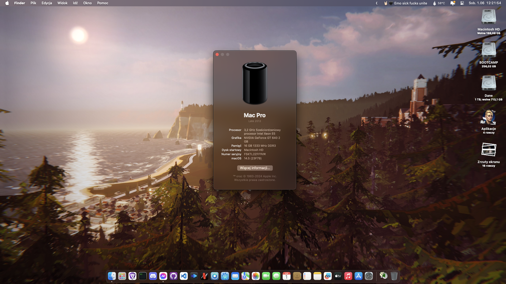

# Hackintosh-OpenCore-HP-Z420

**Premade EFI of OpenCore bootloader for HP Z420 is here, running Ventura and Sonoma!**

## Current Version: [OpenCore 0.9.7 DEBUG](https://github.com/acidanthera/OpenCorePkg/releases/tag/0.9.7)

This repository provides a complete "Plug-and-Play" EFI setup for the OpenCore bootloader, along with all necessary files to install and run macOS on an HP Z420.

## Table of Contents
- [Download](#download)
- [What's Required to Make It Boot?](#whats-required-to-make-it-boot)
- [Running macOS Ventura if you want](#ventura-notes)
- [Installation Guide](#installation)
- [Notes for macOS Monterey if you insist](#monterey-notes)

## Download

```sh
# Clone this repository:
git clone https://github.com/mavethee/Hackintosh-OpenCore-EFI-HP-Z420.git

# Navigate to cloned repository:
cd Hackintosh-OpenCore-EFI-HP-Z420

# Open cloned repository in Finder:
open .
```

OR 

`Code` -> `Downaload ZIP`

Pick either `MacPro6,1` or `MacPro7,1` EFI depending for your likings, as with current improvements and fixes it's cosmetics, read more below closely.

## What's Required to Make It Boot?



1. To run Sonoma successfully, you need at least OpenCore 0.9.3+ (officially 0.8.3 for AVX2 machines). KDKless install is now possible! 🎉  **Avoid RSR updates as they don't work with Rosetta Cryptex.**

2. If you face login sreen issues on 14.1+, stay on 14.0 or disable lockscren and set automatic login before updating to latest. (Seems to be something I've only personally faced, but noting for the record):

`Apple logo -> System settings -> Users and Groups -> Automatic login`

3. Native dGPUs with AVX2 support are recommended. For Polaris and Vega dGPUs, root patching is required, but Navi GPUs are not supported.

4. Lack of AVX2 requires CryptexFixup for macOS 13+.

5. For Metal 1 dGPUs (e.g., Kepler), disable mediaanalysisd using `revblock=media` in NVRAM settings.

6. For non-AVX2 CPUs, disable f16c sysctl reporting by adding `revpatch=16c` to NVRAM settings.

7. OCLP now works with Ventura since 0.5.0+. For Sonoma, OCLP 1.2.1+ is recommended.

8. While Legacy Metal dGPUs work for most part, there are still some issues.

9. Follow OCLP preparation steps, including setting SIP to `0x308` and disabling `Apple Secure Boot`:

-  Set SIP to 0x803: `NVRAM -> Add -> 7C436110-AB2A-4BBB-A880-FE41995C9F82 -> csr-active-config -> 03080000`

-  Disable Apple Secure Boot: `Misc -> Security -> SecureBootModel -> Disable`

-  Disable Signed DMGs loading: `Misc -> Security -> DmgLoading -> Any`

-  Reset NVRAM using `ResetNvramEntry.efi` in `EFI/OC/DRIVERS`.

10. Use [AMFIPass v.1.4.0](https://github.com/dortania/OpenCore-Legacy-Patcher/blob/main/payloads/Kexts/Acidanthera/AMFIPass-v1.4.0-RELEASE.zip) and re-enable AMFI for Sonoma.

11. Install macOS 14, then in post install patch your system using [the latest version of OpenCore Legacy Patcher](https://github.com/dortania/OpenCore-Legacy-Patcher/releases/).

Sources:
- [macOS Sonoma and OpenCore Legacy Patcher Support](https://github.com/dortania/OpenCore-Legacy-Patcher/issues/1076)
- [Preliminary support for macOS Sonoma](https://github.com/dortania/OpenCore-Legacy-Patcher/pull/1077)
- [Legacy Metal Graphics Support and macOS Ventura - Sonoma](https://github.com/dortania/OpenCore-Legacy-Patcher/issues/1008)
- [Idle panic on Metal 1 GPUs during face analysis](https://github.com/dortania/OpenCore-Legacy-Patcher/pull/1013)
- [Rapid Security Response with legacy Macs](https://github.com/dortania/OpenCore-Legacy-Patcher/issues/1019)
- [Resolve CoreGraphics.framework crashing](https://github.com/dortania/OpenCore-Legacy-Patcher/commit/c0825ed24e98688ff430c30324f11b5c41840b8a)
- [Currently unsupported hardware in Ventura](https://dortania.github.io/OpenCore-Legacy-Patcher/VENTURA-DROP.html#currently-unsupported-broken-hardware-in-ventura)

## Ventura Notes


Current config is prepared for booting Sonoma, so if you want to run Ventura, it's not Monterey, it's basically all the same.

If you're not interested in macOS 13, skip this step, [Installation Guide](#installation) awaits if you read [What's Required to Make It Boot?](#whats-required-to-make-it-boot) closely :D

Not like you have much to read here.

## Monterey Notes

Hopefully, Monterey is next in queue after Big Sur so this will get removed soon yaay! :D

If you're not interested in macOS 12, skip this step, [Installation Guide](#installation) awaits if you read [What's Required to Make It Boot?](#whats-required-to-make-it-boot) closely :D


### Current config is prepared for booting Sonoma, so if you want to run Monterey, **revert Ventura and Sonoma NOTE steps.**

0. Remove Sonoma and Ventura related kexts:
   - `EFI/OC/Kexts/CryptexFixup.kext` (Allows non-AVX2 systems to boot on macOS 13 and newer)
   - `EFI/OC/Kexts/KDKLessWorkaround.kext` (Ventura only, KDKless install for macOS 14 is not possible yet)

### For unsupported dGPU:

1. Set SIP to 0x802: `NVRAM -> Add -> 7C436110-AB2A-4BBB-A880-FE41995C9F82 -> csr-active-config -> 02080000`

2. Disable Apple Secure Boot: `Misc -> Security -> SecureBootModel -> Disable`

3. Disable Signed DMGs loading: `Misc -> Security -> DmgLoading -> Any`

4. Reset NVRAM using `ResetNvramEntry.efi` in `EFI/OC/DRIVERS`.

5. (Optional) For auto root patching your unsupported dGPU, add `AutoPkgInstaller.kext` to your `EFI/OC/KEXTS` from [here](https://github.com/dortania/OpenCore-Legacy-Patcher/blob/main/payloads/Kexts/Acidanthera/AutoPkgInstaller-v1.0.2-DEBUG.zip).

6. Flash your config.plist, reboot macOS, and launch OCLP.

7. Follow OCLP prompts and reboot.

## Installation

Internal USB 3.0 doesn't work, but USB 2.0 ports should function properly.

USB mapping is important, so consider using USBMap's QUICKSTART guide [here](https://github.com/corpnewt/USBMap/blob/master/README.md#quick-start).

For USB 3.0, consider using the [Inatek KT4004 PCIe expansion card](https://www.amazon.pl/Inateck-Karta-USB-porty-ExpresCard/dp/B00HJ1DULE?th=1), which has native support.

To install macOS Ventura or newer successfully, you can now use `MacPro6,1` or `MacPro7,1` depending to your likings thanks to RestrictEvents v1.1.3:

- Use EFI from the `MP7,1_InstallEFI` folder (if USB detection issues persist, see the USB section at the end of this README).

- Avoid using the present SMBIOS, as it's likely invalid. Regenerate MacPro7,1 with [GenSMBIOS](https://github.com/corpnewt/GenSMBIOS).

(^Technically both EFIs include both changes but sometimes it losts while maintaining this EFIs, so make sure to validate this one.)

Regardless of your choice, it's recommended to use a hardware-matching SMBIOS for a smoother experience.

## What Works

- Ethernet
- Audio
- USB (except internal USB3 ports)
- iServices (iMessage, FaceTime, AppStore, iCloud, etc.)

## What Doesn't Work

- Internal USB3 ports
- Sleep (Clicking sounds on wake-up attempt)
- Fan Monitoring (needs to be manually mapped in config.plist)

## Credits

- [AMFIPass](https://github.com/dortania/OpenCore-Legacy-Patcher/blob/main/payloads/Kexts/Acidanthera/AMFIPass-v1.4.0-RELEASE.zip)
- [AutoPkgInstaller](https://github.com/dortania/OpenCore-Legacy-Patcher/blob/main/payloads/Kexts/Acidanthera/AutoPkgInstaller-v1.0.2-DEBUG.zip)
- [CryptexFixup](https://github.com/acidanthera/CryptexFixup/releases/)
- [FeatureUnlock](https://github.com/acidanthera/FeatureUnlock/releases/)
- [HibernationFixup](https://github.com/acidanthera/HibernationFixup/releases/)
- [IntelMausi](https://github.com/acidanthera/IntelMausi/releases/)
- [KDKLessWorkaround](https://github.com/dortania/OpenCore-Legacy-Patcher/blob/main/payloads/Kexts/Misc/KDKlessWorkaround-v1.0.0-DEBUG.zip)
- [Lilu](https://github.com/acidanthera/Lilu/releases/)
- [OpenCorePkg](https://github.com/acidanthera/OpenCorePkg/releases/)
- [OpenCanopy's resources](https://github.com/acidanthera/OcBinaryData)
- [OpenCore Legacy Patcher](https://github.com/dortania/OpenCore-Legacy-Patcher/releases/)
- [RestrictEvents](https://github.com/acidanthera/RestrictEvents/releases/)
- [VirtualSMC](https://github.com/acidanthera/VirtualSMC/releases/)
- [WhateverGreen](https://github.com/acidanthera/WhateverGreen/releases/)
