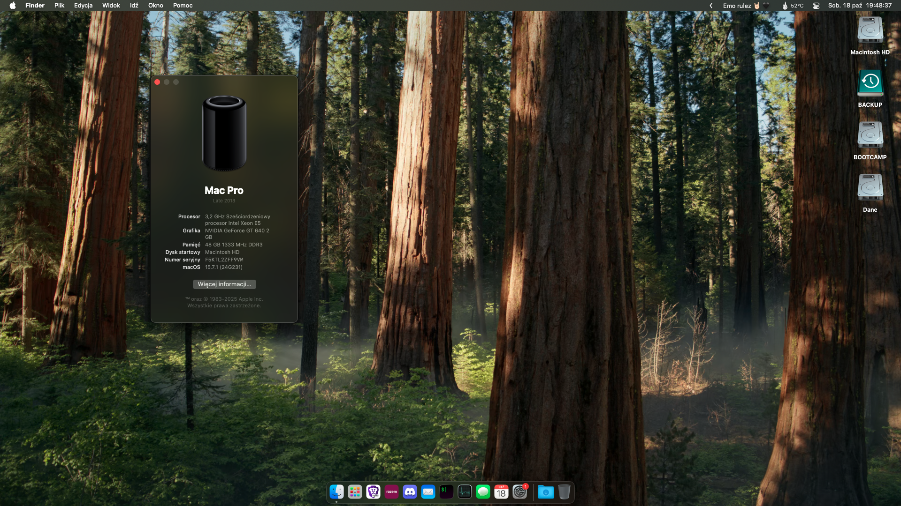

# Hackintosh-OpenCore-HP-Z420

**Premade EFI of OpenCore bootloader for HP Z420 is here, running macOS 15!**

## Current Version: [OpenCore 1.0.4 DEBUG](https://github.com/acidanthera/OpenCorePkg/releases/tag/1.0.4) with [OCLP 2.3.2](https://github.com/dortania/OpenCore-Legacy-Patcher/releases/tag/2.2.0) running macOS 15.4.1 with success! :D

This repository provides a complete "Plug-and-Play" EFI setup for the OpenCore bootloader, along with all necessary files to install and run macOS on an HP Z420.

## Table of Contents

- [How to download?](#how-to-download)
- [What's Required to Make It Boot?](#whats-required-to-make-it-boot)
- [Running macOS Sonoma](#sonoma-notes)
- [Running macOS Ventura](#ventura-notes)
- [Running macOS Big Sur and Monterey on your own security risk, ofc](#big-sur-and-monterey-notes)
- [Installation Guide, general and applicable for all](#installation)

## How to download?

There are four major ways to obtain an EFI from this repository:

a) Head to [release page](https://github.com/mavethee/Hackintosh-OpenCore-EFI-HP-Z420/releases), expand assets of latest release and download `EFI.zip`.

b) Pressing a download button below:

[](https://github.com/mavethee/Hackintosh-OpenCore-EFI-HP-Z420/releases/download/1.0.4/EFI.zip)

c) Downloading zipped repository:

By selecting `Code` -> `Downaload ZIP`

d) Cloning:

```sh
# Clone this repository:
git clone https://github.com/mavethee/Hackintosh-OpenCore-EFI-HP-Z420.git

# Navigate to cloned repository:
cd Hackintosh-OpenCore-EFI-HP-Z420

# Open cloned repository in Finder:
open .
```

Finally, extract, put `EFI` on your USB.

## What's Required to Make It Boot?



While EFI is premade to address all issues it's a key to understand them, in case of any issues, during install process.

1. Patience and carefully reading docs and understanding the process! :D

2. Lack of AVX2 (Ventura introduced requirement) needs [CryptexFixup](https://github.com/acidanthera/CryptexFixup/releases/) kext for macOS 13+ to boot, remember to disable f16c sysctl reporting by adding `revpatch=16c` to NVRAM settings.

3. For modern AMD GPUs, e.g Polaris and Vega, root patching is required to patch AVX2 driver stack, Navi GPUs are not supported yet.

4. For Metal 1 dGPUs (e.g., Kepler, even tho it reports itself as `Metal 2` capable, **it's not**), disable `mediaanalysisd` with help of [RestrictEvents](https://github.com/acidanthera/RestrictEvents/releases/) kext and using `revblock=media` in NVRAM settings.

5. With macOS 12.3 Beta 1+, Apple dropped the 'plugin-type' check within X86PlatformPlugin, you need to add [ASPP-Override v1.0.1](https://github.com/dortania/OpenCore-Legacy-Patcher/blob/main/payloads/Kexts/Misc/ASPP-Override-v1.0.1.zip) kext to your `EFI/OC/KEXTS`.

6. OCLP works with Sonoma the best with 1.5.0+! But with macOS Sequoia, it is supported since 2.0.0, but as it's active development, latest OCLP is always recommended (and even mandatory!).

7. While Legacy Metal dGPUs work for most part, there are still some issues, see [here](https://github.com/dortania/OpenCore-Legacy-Patcher/issues/1008).

8. Follow OCLP preparation steps (`EFI/OC/config.plist` modification):

   - Set SIP to 0x803: `NVRAM` -> `Add` -> `7C436110-AB2A-4BBB-A880-FE41995C9F82` -> `csr-active-config` -> `03080000`

   - Disable Apple Secure Boot: `Misc` -> `Security` -> `SecureBootModel` -> `Disable`

   - Disable Signed DMGs loading: `Misc` -> `Security` -> `DmgLoading` -> `Any`

   - Reset NVRAM using `ResetNvramEntry.efi` in `EFI/OC/DRIVERS`.

   - Use [AMFIPass v1.4.1](https://github.com/dortania/OpenCore-Legacy-Patcher/blob/main/payloads/Kexts/Acidanthera/AMFIPass-v1.4.1-RELEASE.zip) and re-enable AMFI for macOS 14+.

   - If you have an access to real Macs or you're upgrading your Hackintosh to newer macOS release (**it's always reccommended in case of huge releases, e.g 14 -> 15**), you can create offline installer using OCLP (skipping EFI part for obvious reason - **Build and Install OpenCore**) but don't forget about [AutoPkgInstaller](https://github.com/dortania/OpenCore-Legacy-Patcher/blob/main/payloads/Kexts/Acidanthera/AutoPkgInstaller-v1.0.4-DEBUG.zip) kext for patching the graphics acceleration during install process, which saves you from manual root patching till next macOS update :P

9. Install macOS 15, then make sure to grab [the latest version of OpenCore Legacy Patcher](https://github.com/dortania/OpenCore-Legacy-Patcher/releases/).

10. As of now, you should have basic understanding of the proccess for older hardware and modern macOS (for maOS 12 and below check), you can head to [Installation Guide](#installation).

Sources:

- [macOS Sequoia and OpenCore Legacy Patcher Support](https://github.com/dortania/OpenCore-Legacy-Patcher/issues/1136)
- [Legacy Metal Graphics Support and macOS Ventura - Sequoia](https://github.com/dortania/OpenCore-Legacy-Patcher/issues/1008)
- ...and some of my observations o7

## Sonoma Notes


If you're not interested in macOS 14, skip this step, [Installation Guide](#installation) awaits if you read [What's Required to Make It Boot?](#whats-required-to-make-it-boot) closely :D

Exact same process from end user perspective as with macOS 15, so read section above if you haven't, here's just covered a few basics:

- To run Sonoma successfully, you need at least OpenCore 0.9.3+ (officially 0.8.3 for AVX2 machines, latest updates are minor, but I recommend sticking to latest)  **Avoid RSR updates as they don't work with Rosetta Cryptex (Feature seems to be a flop anyways).**

- If you face login sreen issues on 14.1+, stay on 14.0 or disable lockscren and set automatic login before updating to latest. (Seems to be something I've only personally faced, but noting for the record):

   `Apple logo` -> `System settings` -> `Users and Groups` -> `Automatic login`

   **FIXED:** Update to **macOS 14.4+** and Root Patch with latest OpenCore Legacy Patcher release (**1.4.2 fixed the issue, but latest is more than recommended**)

With how mature, macOS 14 now is I suggest sticking with latest release (macOS 14.7 for the time of writting).

Sources:

- [macOS Sonoma and OpenCore Legacy Patcher Support](https://github.com/dortania/OpenCore-Legacy-Patcher/issues/1076)
- [Preliminary support for macOS Sonoma](https://github.com/dortania/OpenCore-Legacy-Patcher/pull/1077)

## Ventura Notes


Current config is prepared for booting Sequoia, so if you want to run Ventura, it's not Monterey, it's basically all the same.
If you're not interested in macOS 13, skip this step, [Installation Guide](#installation) awaits if you read [What's Required to Make It Boot?](#whats-required-to-make-it-boot) closely :D

Not like you have much to read here.

Sources:

- [macOS Ventura and OpenCore Legacy Patcher Support](https://github.com/dortania/OpenCore-Legacy-Patcher/issues/998)
- [Idle panic on Metal 1 GPUs during face analysis](https://github.com/dortania/OpenCore-Legacy-Patcher/pull/1013)
- [Rapid Security Response with legacy Macs](https://github.com/dortania/OpenCore-Legacy-Patcher/issues/1019)
- [Resolve CoreGraphics.framework crashing](https://github.com/dortania/OpenCore-Legacy-Patcher/commit/c0825ed24e98688ff430c30324f11b5c41840b8a)
- [Currently unsupported hardware in Ventura](https://dortania.github.io/OpenCore-Legacy-Patcher/VENTURA-DROP.html#currently-unsupported-broken-hardware-in-ventura)
   (Most of it's content is now part of [What's Required to Make It Boot?](#whats-required-to-make-it-boot) section, it's just to keep things clean)

## Big Sur and Monterey Notes

As Apple is moving on, it's not advised to run thoose operating systems and prebuild EFI is not configured to run them properly.

If you're not interested in macOS 12 and below, skip this step, [Installation Guide](#installation) awaits if you read [What's Required to Make It Boot?](#whats-required-to-make-it-boot) closely :D

### Current config is prepared for booting Sequioa, so if you want to run Monterey, **revert steps needed for macOS 13+.**

0. (Optional as no real effect) Disable skipping the SMBIOS check as it's fully supported on macOS 12 and lower:

1. Remove macOS 13+ related kexts:
   - `EFI/OC/Kexts/CryptexFixup.kext` (Allows non-AVX2 systems)
   - `EFI/OC/Kexts/KDKLessWorkaround.kext` (KDKless install)
   - `EFI/OC/Kexts/RSRHelper.kext` (Rapid Security Response)

2. macOS Monterey:

   

   This section is split in three parts, make sure to follow instructions for you case.

      a) For supported dGPUs, which since macOS 12.0 Beta 7 only AMD dGPUs (you can check [here](https://dortania.github.io/GPU-Buyers-Guide/modern-gpus/amd-gpu.html#native-amd-gpus)) and just follow the [Dortania's OpenCore Install Guide](https://dortania.github.io/OpenCore-Install-Guide/config-HEDT/ivy-bridge-e.html) but if you wish to modify this EFI, make sure to follow this steps below:

      - Remove `AutoPkgInstaller.kext` if you have the `AutoPkgInstaller.kext` in `EFI/OC/KEXTS` from [here](https://github.com/dortania/OpenCore-Legacy-Patcher/blob/main/payloads/Kexts/Acidanthera/AutoPkgInstaller-v1.0.4-DEBUG.zip) as it's optional kext for OCLP purposes.

      - Revert OCLP prepartion changes by double checking with [Dortania's OpenCore Install Guide](https://dortania.github.io/OpenCore-Install-Guide/config-HEDT/ivy-bridge-e.html) for steps for dummies, which fully supports this configuration.

      b) For unsupported dGPU (Unlike Ventura, you can pick supported dGPU for this system without issues, follow this if macOS 12.0 Beta 7 removed support for your GPU, e.g Kepler):

      1. Set SIP to `0x802`: `NVRAM` -> `Add` -> `7C436110-AB2A-4BBB-A880-FE41995C9F82` -> `csr-active-config` -> `02080000`

      2. Disable Apple Secure Boot: `Misc` -> `Security` -> `SecureBootModel` -> `Disable`

      3. Disable Signed DMGs loading: `Misc` -> `Security` -> `DmgLoading` -> `Any`

      4. Reset NVRAM using `ResetNvramEntry.efi` in `EFI/OC/DRIVERS`.

      5. (Optional) For auto root patching your unsupported dGPU, double check if you have the `AutoPkgInstaller.kext` in `EFI/OC/KEXTS` from [here](https://github.com/dortania/OpenCore-Legacy-Patcher/blob/main/payloads/Kexts/Acidanthera/AutoPkgInstaller-v1.0.4-DEBUG.zip).

      6. Flash your config.plist, reboot macOS, and launch OCLP.

      7. Follow OCLP prompts and reboot.

      c) Steps for all:

      - For macOS 12.3 Beta 1+, Apple dropped the 'plugin-type' check within X86PlatformPlugin, double check if you have the [ASPP-Override v1.0.1](https://github.com/dortania/OpenCore-Legacy-Patcher/blob/main/payloads/Kexts/Misc/ASPP-Override-v1.0.1.zip) kext in your `EFI/OC/KEXTS`, see more [here](https://github.com/dortania/OpenCore-Legacy-Patcher/commit/1393db72ddf8f8acac27d1f65c5644ce89cc1d81).

3. macOS Big Sur:

   

   Apple in macOS 11 was generous and didn't removed or dropped most kexts, so support for the hardware is there, but keep in mind it wasn't updated for more than a year now, it's not advised daily driver.

   - You can just follow the [Dortania's OpenCore Install Guide](https://dortania.github.io/OpenCore-Install-Guide/config-HEDT/ivy-bridge-e.html) and that's pretty much it.

   - If you want, you can also modify this EFI:

      1. Remove macOS 12+ and OCLP related kexts:

         - `EFI/OC/Kexts/AutoPkgInstaller.kext` (For OCLP purposes),

         - `EFI/OC/Kexts/ASPP-Override.kext` (For XCPM disabling on 12.3 Beta 1+).

      2. Remove OCLP prepartion steps, mentioned in Monterey step for supported dGPUs.

4. With that done, you can head to [Installation Guide](#installation).

## Installation

Internal USB 3.0 doesn't work, but USB 2.0 ports should function properly.

USB mapping is important (as it's broken since macOS 11.3+), so consider using USBMap's QUICKSTART guide [here](https://github.com/corpnewt/USBMap/blob/master/README.md#quick-start).

For USB 3.0, consider using the [Inatek KT4004 PCIe expansion card](https://www.amazon.pl/Inateck-Karta-USB-porty-ExpresCard/dp/B00HJ1DULE?th=1), which has native support.

To install macOS successfully:

- Use EFI from the `EFI` folder (if USB detection issues persist, see the USB section at the end of this README).

- Avoid using the present SMBIOS, as it's likely invalid. Regenerate using [GenSMBIOS](https://github.com/corpnewt/GenSMBIOS) for working iServices.

## What Works?

- Ethernet
- Audio
- USB (except internal USB3 ports)
- iServices (iMessage, FaceTime, AppStore, iCloud, etc.)

## What Doesn't Work?

- Internal USB3 ports, use PCIe ones, keep in mind they wont be visable by BIOS.
- Sleep (Clicking sounds on wake-up attempt)
- Fan Monitoring (needs to be manually mapped in config.plist?)

## Credits

- [ASP-Override](https://github.com/dortania/OpenCore-Legacy-Patcher/blob/main/payloads/Kexts/Misc/ASPP-Override-v1.0.1.zip)
- [AMFIPass](https://github.com/dortania/OpenCore-Legacy-Patcher/blob/main/payloads/Kexts/Acidanthera/AMFIPass-v1.4.1-RELEASE.zip)
- [AutoPkgInstaller](https://github.com/dortania/OpenCore-Legacy-Patcher/blob/main/payloads/Kexts/Acidanthera/AutoPkgInstaller-v1.0.4-DEBUG.zip)
- [CryptexFixup](https://github.com/acidanthera/CryptexFixup/releases/)
- [FeatureUnlock](https://github.com/acidanthera/FeatureUnlock/releases/)
- [HibernationFixup](https://github.com/acidanthera/HibernationFixup/releases/)
- [IntelMausi](https://github.com/acidanthera/IntelMausi/releases/)
- [KDKLessWorkaround](https://github.com/dortania/OpenCore-Legacy-Patcher/blob/main/payloads/Kexts/Misc/KDKlessWorkaround-v1.0.0-DEBUG.zip)
- [Lilu](https://github.com/acidanthera/Lilu/releases/)
- [OpenCorePkg](https://github.com/acidanthera/OpenCorePkg/releases/)
- [OpenCanopy's resources](https://github.com/acidanthera/OcBinaryData)
- [OpenCore Legacy Patcher](https://github.com/dortania/OpenCore-Legacy-Patcher/releases/)
- [RestrictEvents](https://github.com/acidanthera/RestrictEvents/releases/)
- [VirtualSMC](https://github.com/acidanthera/VirtualSMC/releases/)
- [WhateverGreen](https://github.com/acidanthera/WhateverGreen/releases/)
